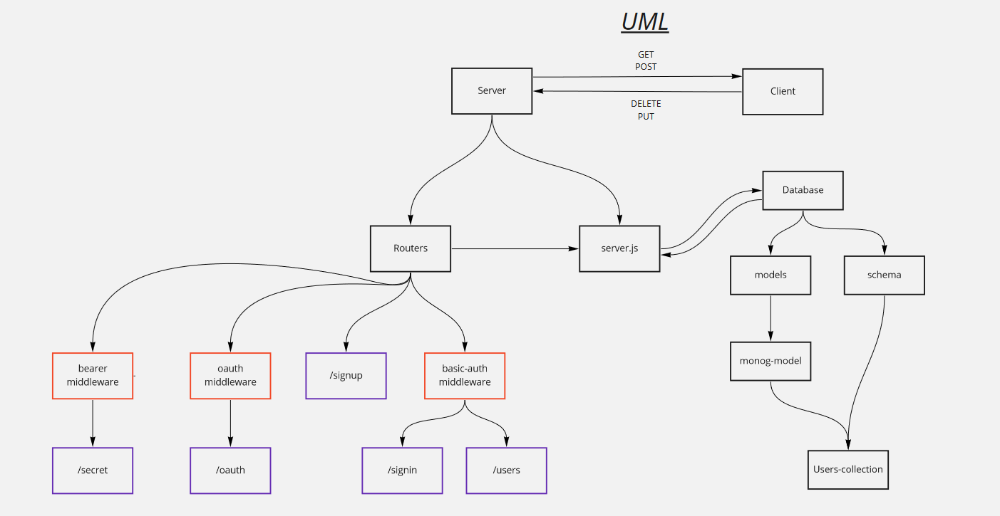

## Project: auth-server

### Author: Osama Hanoun

### Links and Resources


### Setup

#### `.env` requirements (where applicable)

```
MONGOOSE_URL=mongodb://localhost:27017/auth-server
PORT=3000
TOKEN_SERVER=https://github.com/login/oauth/access_token
REMOTE_API=https://api.github.com/user
exchangeCodeWithToken 
CLIENT_ID=ee7f84a61951b6bf75a4
CLIENT_SECRET=2437994506747684265ea72118da29a2ec3b5dde
API_SERVER=http://localhost:3000/oauth
```
#### How to initialize/run your application (where applicable)

-  `npm start`

#### How to use your library (where applicable)

#### Tests

- How do you run tests? npm test
- Any tests of note? none
- Describe any tests that you did not complete, skipped, etc

#### UML

