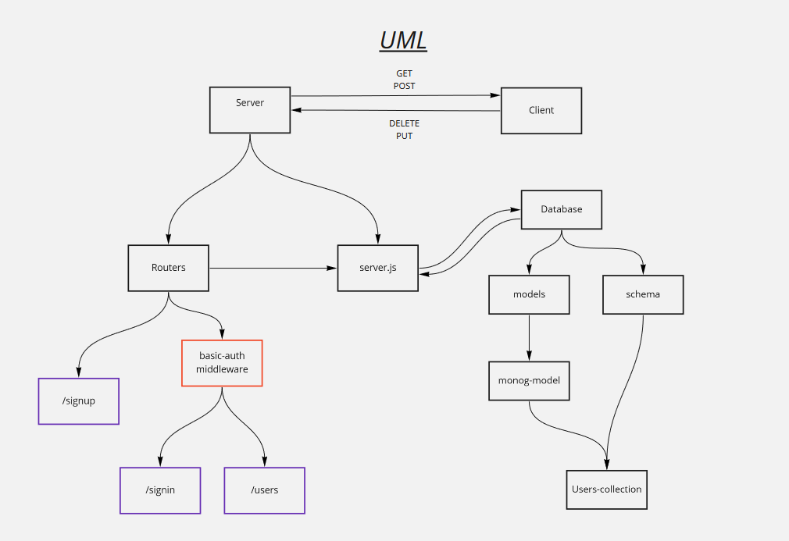

# LAB - Class 11

## Project: auth-server

### Author: Osama Hanoun

### Links and Resources

### Setup

#### `.env` requirements (where applicable)

i.e.

- `PORT` - 3000
- `MONGODB_URI` mongodb://localhost:27017/auth-server - 

#### How to initialize/run your application (where applicable)

-  `npm start`

#### How to use your library (where applicable)

#### Tests

- How do you run tests? npm test
- Any tests of note? none
- Describe any tests that you did not complete, skipped, etc

#### UML

